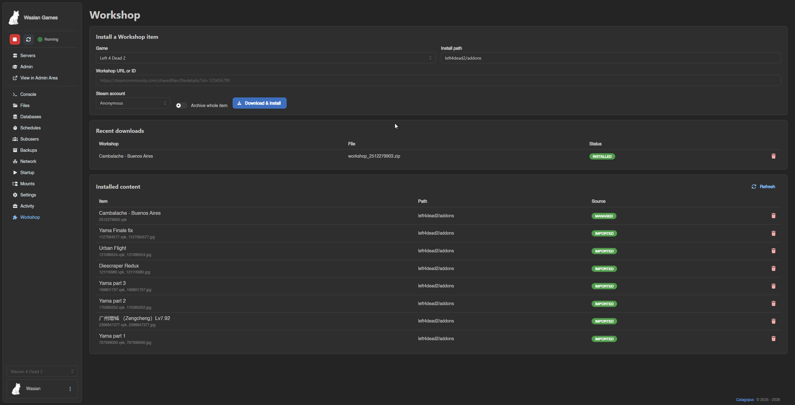
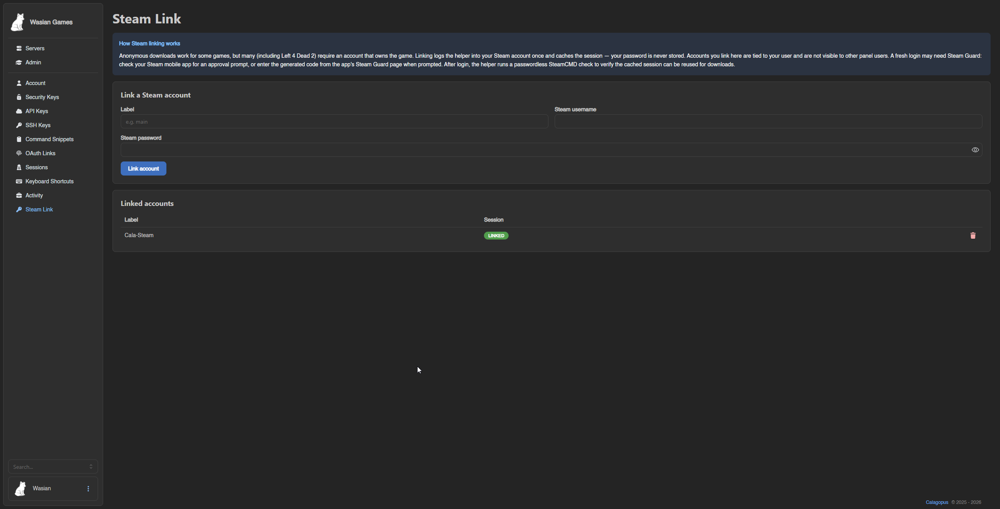
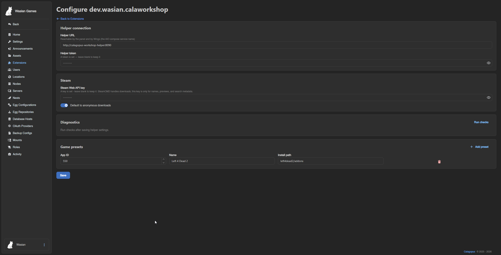

# calaworkshop

[](https://github.com/WasianMan/CalaWorkshop/actions/workflows/ci.yml)
[](https://github.com/WasianMan/CalaWorkshop/actions/workflows/release.yml)
[](./LICENSE)

Steam Workshop installs for [Calagopus](https://calagopus.com), shipped as:

- a Calagopus panel extension: `dev.wasian.calaworkshop`
- a small SteamCMD helper container: `ghcr.io/wasianman/calaworkshop-helper`

It adds a per-server **Workshop** tab where you paste a Workshop URL/ID, download
through SteamCMD, and install the selected files onto the game server through Wings.
The first target is **Left 4 Dead 2**, including normal VPK + preview image pairs,
but other Steam games can be added through presets.

> **Status: alpha.** This is a side project I use on my own server and share in
> case it helps others. It is functional end-to-end, but expect rough edges and
> occasional breaking changes while it settles. No warranty; see [LICENSE](./LICENSE).

## What Works

- Paste Workshop URL/ID and install through Wings `files/pull`
- Persistent download history and installed-item tracking
- Managed/imported/unmanaged installed-content list
- Precise uninstall of files tracked by this extension
- Data-driven, multi-game install rules: per-game presets with glob selection and
  a rename template (the L4D2 `<workshop_id>.vpk` + preview naming is just the
  default preset's rule). Unconfigured games mirror every downloaded file.
- Best-effort game auto-detection from the server's egg, preselecting the preset
- Per-user Steam account linking with Steam Guard/mobile-auth support
- Helper and SteamCMD diagnostics in the admin config page

Search UI, collection expansion, and richer update/reinstall workflows are still on
the roadmap.

## How It Works

```text
Workshop tab  -> extension backend -> helper container -> SteamCMD download
     |                  |                    |
     |                  |                    v
     |                  +---- Wings files/pull from helper /files/<job>
     v
server volume receives the selected Workshop files
```

The panel extension does not run SteamCMD and does not mount game-server volumes.
The helper downloads items and serves a temporary artifact. Wings pulls that helper
URL into the server volume, so the same path works for AIO and remote nodes.

Full design: [docs/ARCHITECTURE.md](./docs/ARCHITECTURE.md)
Helper contract: [CONTRACT.md](./CONTRACT.md)

## Install

Use the public release artifacts:

- `ghcr.io/wasianman/calaworkshop-helper:<version>` or `:latest`
- `dev_wasian_calaworkshop.c7s.zip` from the latest
  [GitHub Release](https://github.com/WasianMan/CalaWorkshop/releases)

Short version:

1. Switch the Calagopus panel to `ghcr.io/calagopus/panel:heavy-aio`.
2. Add the heavy-image build mounts.
3. Add the `calagopus-workshop-helper` service from
   [compose.aio.example.yml](./compose.aio.example.yml).
4. Allow Wings to pull from the helper's private Docker subnet.
5. Put `dev_wasian_calaworkshop.c7s.zip` in `/app/extensions`.
6. Redeploy/restart and configure the helper URL/token in the admin panel.

Detailed AIO/Coolify steps: [docs/DEPLOY.md](./docs/DEPLOY.md)

## Steam Notes

- SteamCMD handles downloads.
- A Steam Web API key is optional and only improves metadata like titles, previews,
  and future search results.
- Anonymous downloads work only for games Steam allows. **Left 4 Dead 2 generally
  requires a linked Steam account that owns the game.**
- Linked accounts are per panel user. The helper stores only SteamCMD session files
  and the username metadata needed to reuse the session; it does not store the
  password.
- After linking, the helper runs a passwordless cached-session check before marking
  the account verified.

## Repository Layout

```text
calaworkshop/
├── extension/              # packaged into dev_wasian_calaworkshop.c7s.zip
│   ├── backend/            # Rust extension routes/settings/helper client
│   ├── frontend/           # React Workshop, Steam Link, and admin pages
│   └── migrations/         # extension DB migrations
├── helper/                 # Rust SteamCMD helper service + Dockerfile
├── packaging/              # .c7s archive builders
├── docs/                   # deploy and architecture docs
├── compose.aio.example.yml # reference AIO stack with helper wired in
└── CONTRACT.md             # extension <-> helper HTTP contract
```

## Permissions

| Scope | Permission | Allows |
| --- | --- | --- |
| server | `workshop.read` | View Workshop tab and installed content |
| server | `workshop.install` | Download, install, and track Workshop items |
| server | `workshop.remove` | Remove tracked installed content |
| user | `calaworkshop.link-steam` | Link and manage personal Steam accounts |
| admin | `calaworkshop.configure` | Configure helper, API key, presets, diagnostics |

## Development

- Helper: `cd helper && cargo build`
- Helper locally: `WORKSHOP_HELPER_TOKEN=dev cargo run`
- Extension archive:
  - Windows: `packaging/build-c7s.ps1`
  - Linux/CI: `packaging/build-c7s.sh`

The extension backend inherits the Calagopus panel workspace and does not compile
standalone from this repository. It is compiled by the panel heavy image during
install. See [CONTRIBUTING.md](./CONTRIBUTING.md) for more detail.

## Version

Current release: **v0.2.4**
Changelog: [CHANGELOG.md](./CHANGELOG.md)

## Screenshots

| Server Workshop | Steam Link | Admin Settings |
| --- | --- | --- |
|  |  |  |

## License

**MIT + [Commons Clause](https://commonsclause.com/)**. Free for personal and
internal use; you may not sell it or offer a hosted/commercial service based on it
without a commercial license. See [LICENSE](./LICENSE). Commercial inquiries:
`adam@wasian.dev`.

Source-available, not OSI open source, because commercial selling is restricted.
